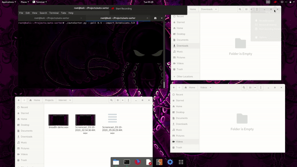

# Auto Sorter v1.4.1
<p align=left>
<a target="_blank" href="https://github.com/K0p1-Git/autoSorter/"></a>
<a target="_blank" href="https://www.python.org/downloads/" title="Python version"></a>
<a target="_blank" href="https://github.com/K0p1-Git/AutoSorter/blob/master/LICENSE.md" title="License"></a>
<a target="_blank" href="https://twitter.com/intent/tweet?text=Improve%20Productivity%20with%20Auto%20Sorter%20&url=https://github.com/K0p1-Git/autoSorter/&&hashtags=Productivity,%20Python,%20Script" title="Share on Tweeter"></a>
</p>


```
                                           _           _____            _            
                                /\        | |         / ____|          | |           
                               /  \  _   _| |_ ___   | (___   ___  _ __| |_ ___ _ __ 
                              / /\ \| | | | __/ _ \   \___ \ / _ \| '__| __/ _ \ '__|
                             / ____ \ |_| | || (_) |  ____) | (_) | |  | ||  __/ |   
                            /_/    \_\__,_|\__\___/  |_____/ \___/|_|   \__\___|_|   

                                      Version 1.4.1  -  Twitter @ K0p1_
```

</p>
<p align="center">

</p>


Auto Sorter is a automatic file sorter, relocate files to where they rightfully belong, based on file extensions.
- Customizable storage location
- <a href='./extensions.txt'>Customizable extensions mapping</a>
- Adjustable Polling Rate
- Easy run and forget quality of life script 

__Note: This is a work in progress, everything is subjected to change. More in-depth tutorial coming soon!__

## Change Log v 1.4.1

- Minor Bug Fix

## Change Log v 1.4.0
- Added arguments functions
  - **-h/--help** : For help
  - **--poll**    : For custom poll rate
  - **--version** : For version details
  - **--import**  : For custom import of extension / directories file
 - Re-worked <a href='./extensions.txt'>extensions.txt</a>
```
 Format:  
  [EXTENSION]  [CATEGORY]  [LOCATION]
```
For previous update : <a href=./HISTORY.md>HISTORY.md</a> 

## Prerequisite 

[Python 3.6 or above ](https://www.python.org/download/releases/3.0/) is required to run the script.

```bash
$ sudo apt install python3
```

## Usage

```bash
# clone the repo
$ git clone https://github.com/K0p1-Git/AutoSorter.git

# change the working directory to Auto Sorter
$ cd AutoSorter

# chmod +x if required
$ chmod +x autoSorter.py
```
## To-Do(s)
- Make settings persistent throughout lifetime
- Create script to automate testing

## Contributing
When contributing to this repository, please first discuss the change you wish to make via <a href='https://github.com/K0p1-Git/AutoSorter/issues'>issue</a> or contact me via <a href='https://twitter.com/K0p1_'>twitter</a> before making a change.

Code of conduct to be added soon. 

## License
<a href='./LICENSE.md'>LICENSE.md</a>

